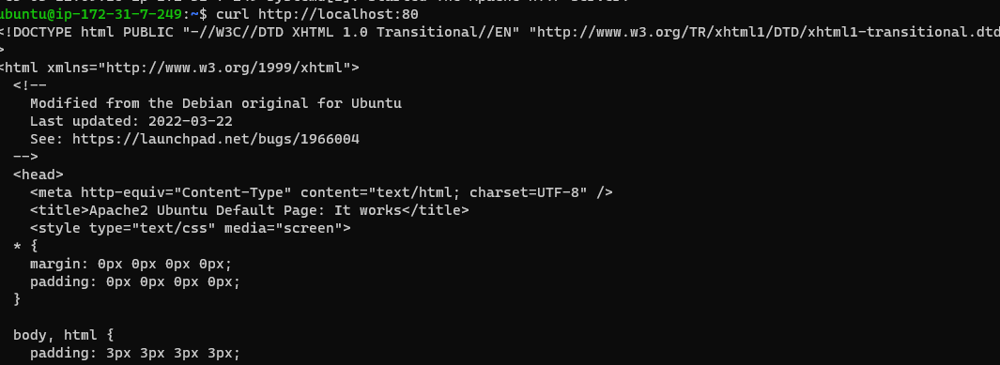
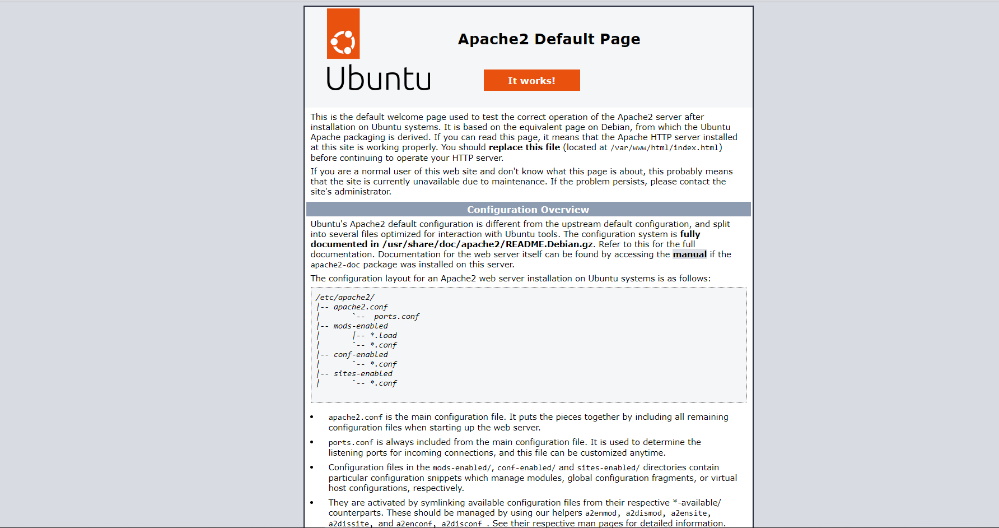
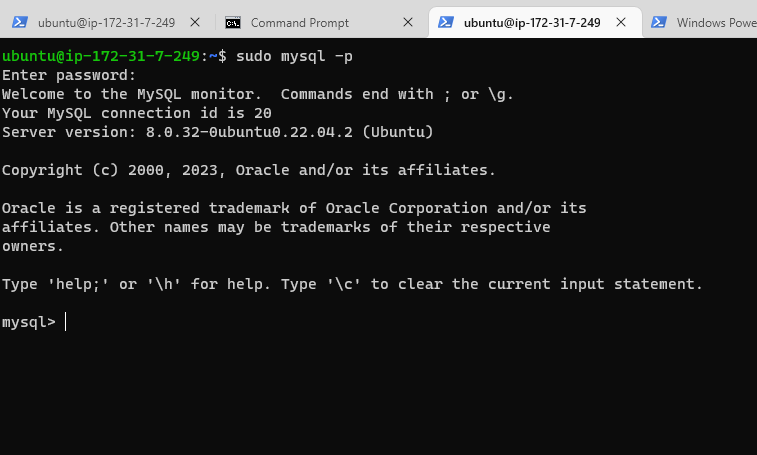
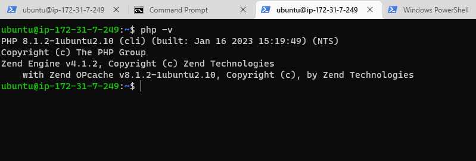
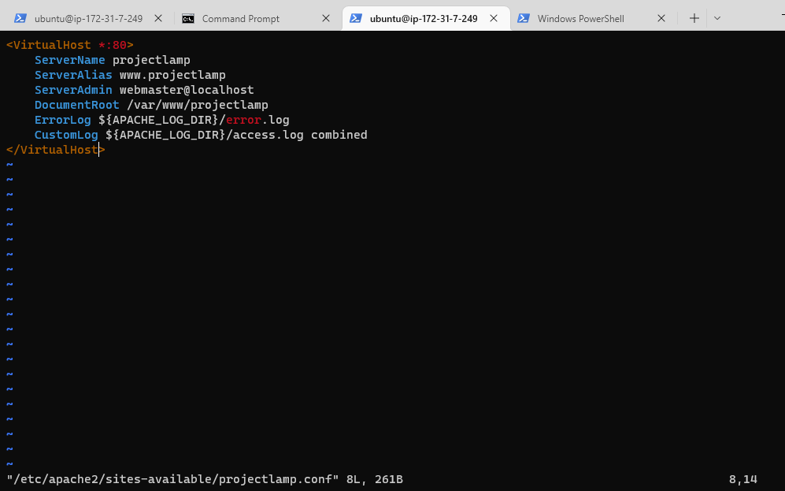
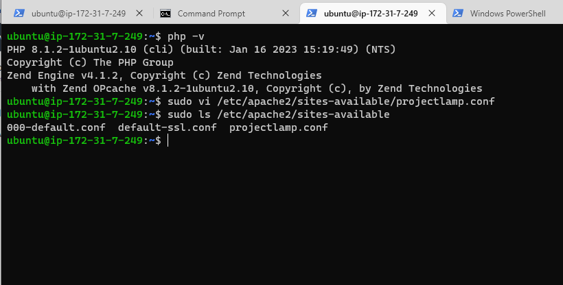
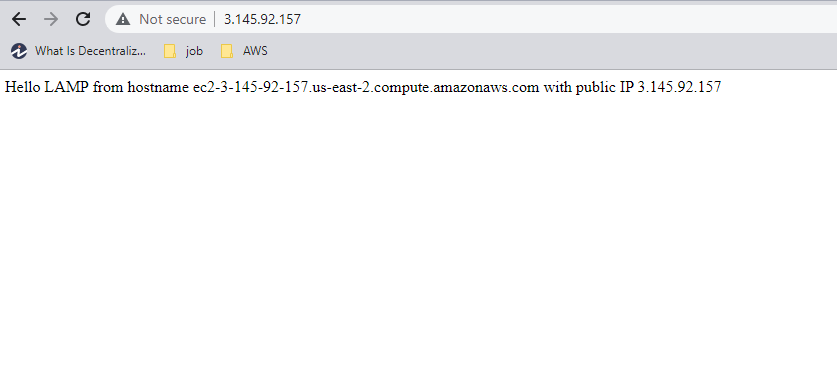
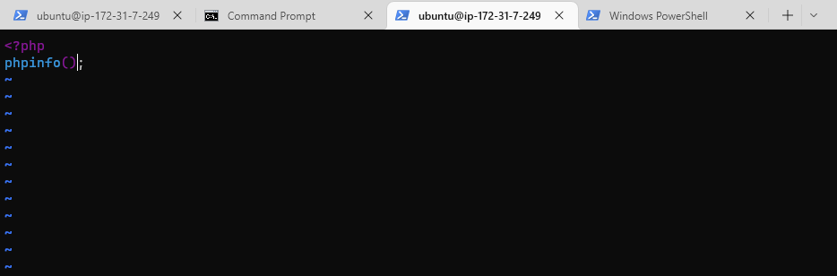
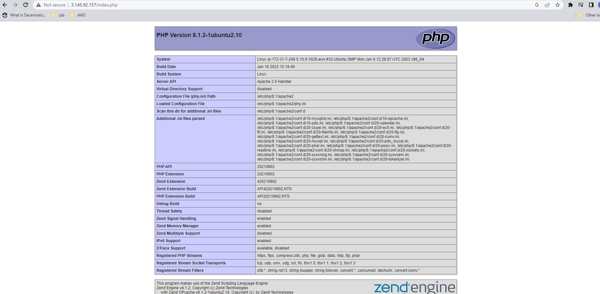

## Project 1 Documentation

# STEP 1 - INSTALLING APACHE AND UPDATING THE FIREWALL
`sudo apt update`
`sudo apt install apache2`

## Verification of apache2 running as a service
`sudo systemctl status apache2`

## Accessing server locally
`curl http:localhost:80`

## Accessing server on the web
`http://<Public-IP-Address>:80`

# STEP 2 - INSTALLING MYSQL
`$ sudo apt install mysql-server`
`$ sudo mysql`

## Interactive Script
`$ sudo mysql_secure_installation`

## Login test into MYSQL Console
`$ sudo mysql -p`

# STEP 3 - INSTALLING PHP

## Installing the necessary php and some dependency packages
`sudo apt install php libapache2-mod-php php-mysql`

## Confirming the PHP Version
`php -v`

# STEP 4 - CREATING VIRTUAL HOST FOR WEBSITE USING APACHE

### Creating directory
`sudo mkdir /var/www/projectlamp`

### assigning ownership of directory with current system user
` sudo chown -R $USER:$USER /var/www/projectlamp`

### Creating a new config in Apache's sites-available directory
`sudo vi /etc/apache2/sites-available/projectlamp.conf`

### Lisitng the new files in the sites-available directory
`sudo ls /etc/apache2/sites-available`

### Enabling the new virtual host
`sudo a2ensite projectlamp`

### Disabling the default website ubstakked with apache
`sudo a2dissite 000-default`

### Avoiding configuration error
`sudo apache2ctl configtest`

### Reloading Apache
`sudo systemctl reload apache2`

### Creating index.html file in the web root /var/www/projectlamp
`sudo echo 'Hello LAMP from hostname' $(curl -s http://169.254.169.254/latest/meta-data/public-hostname) 'with public IP' $(curl -s http://169.254.169.254/latest/meta-data/public-ipv4) > /var/www/projectlamp/index.html`

### Dsiplaying the new webpage
`http://<Public-IP-Address>:80`

# STEP 5 - ENABLING PHP ON THE WEBSITE

### Creating an index.php file in the custom web root folder
`vim /var/www/projectlamp/index.php`

### Test script to confirm php installation
`http://server_domain_or_IP/index.php`

