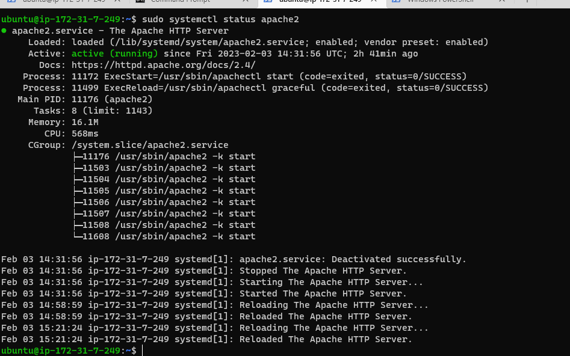

## Project 1 Documentation

### STEP 1 - INSTALLING APACHE AND UPDATING THE FIREWALL
	`sudo apt update`
	`sudo apt install apache2`

## verification of apache2 running as a service
	`sudo systemctl status apache2`
    

## Accessing server locally
	`curl http:localhost:80`
	

## Accessing server on the web
	`http://<Public-IP-Address>:80`
	